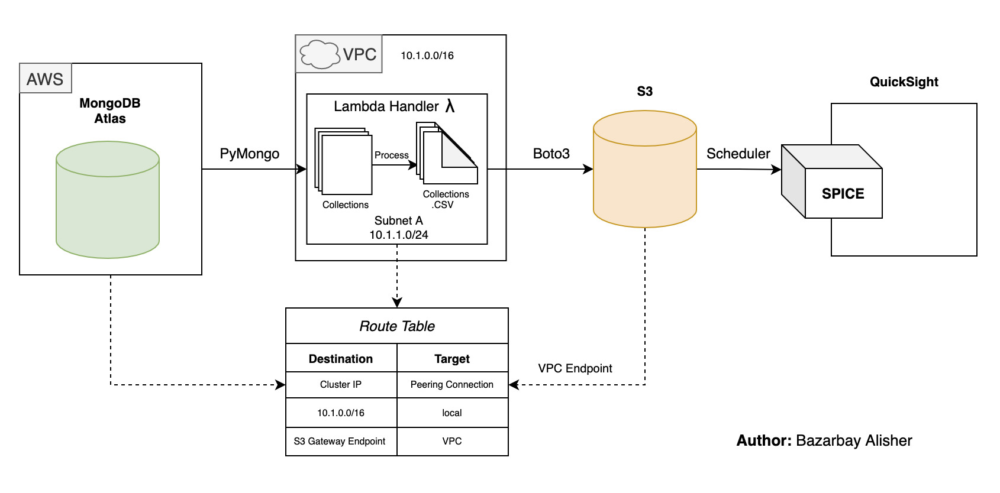

# Data Transfer

Data transfer from MongoDB to AWS S3 bucket for further data visualization in AWS QuickSight. 
                    `The names of collections and attributes are replaced with dummies`

- Data is extracted by Lambda function (with pymongo library) configured in a VPC with a private subnet. 

- Further, collections are uploaded to S3 (boto3) with a VPC gateway endpoint. The route table is shown on the scheme. 

- The database and handler are connected via peering connection (voiding connection via global network).

- In **`utils.attributes.py`** lists with needed columns are stored; **`utils.formatHelper.py`** contains functions needed to format the datetime columns as some of them has UNIX or GMT formats; **`formatColumns.py`** is module used to run helpers and format columns.

- The lambda helper overwrites the existing files and also creates the archive, and saves the extracted data.
